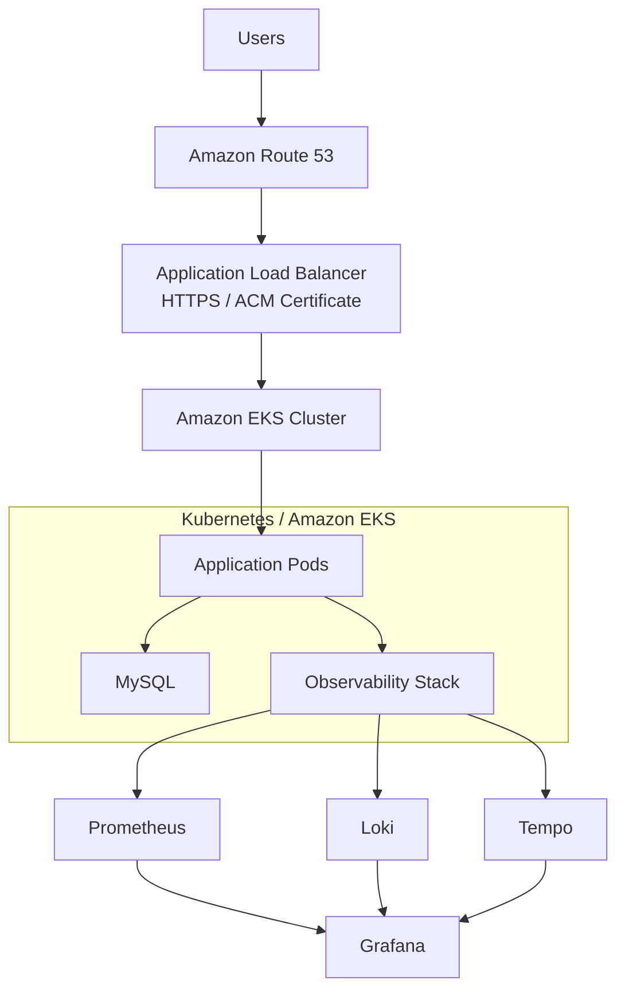
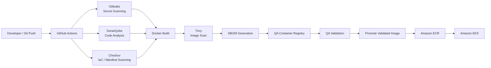
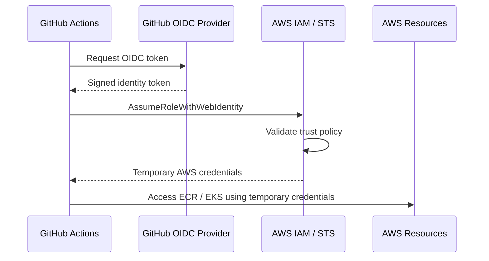
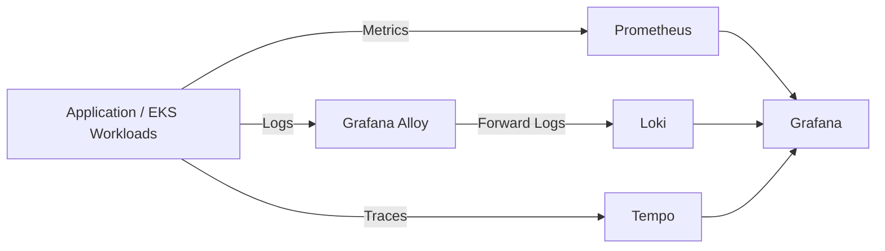

# Secure CI/CD & Kubernetes Deployment on AWS EKS

An end-to-end **DevSecOps project** demonstrating the secure build, validation, promotion, deployment, and observability of a containerized application running on **Amazon EKS**.

The project uses **GitHub Actions** for CI/CD, integrates automated security checks across source code, infrastructure/configuration, and container images, and securely authenticates GitHub Actions to AWS using **OpenID Connect (OIDC)** and IAM roles instead of long-lived AWS credentials.

Validated container images are promoted from the QA environment to the production registry **without rebuilding**, helping ensure that the artifact deployed to production is the same artifact that passed the preceding security and validation stages.

---

## Tech Stack

**Cloud & Kubernetes:** AWS, Amazon EKS, Kubernetes, Amazon ECR, Application Load Balancer (ALB), Route 53, ACM

**CI/CD:** GitHub Actions, Self-Hosted GitHub Actions Runner

**Security:** SonarQube, Gitleaks, Checkov, Trivy, SBOM, AWS IAM, GitHub OIDC

**Containerization:** Docker

**Observability:** Prometheus, Grafana, Loki, Tempo, Grafana Alloy

**Application:** Node.js, MySQL

---

## Key Highlights

* Built an end-to-end CI/CD pipeline using **GitHub Actions** for automated build, security validation, image publishing, and deployment to Amazon EKS.
* Reduced pipeline execution time from approximately **5 minutes to 2.5 minutes (~50%)** using self-hosted runners, pre-installed dependencies, and parallel execution of independent stages.
* Integrated **Gitleaks, SonarQube, Checkov, Trivy, and SBOM generation** into the CI pipeline.
* Implemented **GitHub OIDC-based authentication with AWS IAM**, eliminating the need to store long-lived AWS access keys in GitHub.
* Used separate IAM roles for QA and production workflows to enforce **environment isolation and least-privilege access**.
* Implemented **QA-to-production artifact promotion** without rebuilding the validated container image.
* Used **commit-SHA-based image tagging** to provide traceability between source code, pipeline runs, and deployed container images.
* Deployed the application on **Amazon EKS** and exposed it securely through an AWS Application Load Balancer.
* Configured **Route 53 and AWS Certificate Manager (ACM)** for custom-domain routing and HTTPS/TLS.
* Implemented observability using **Prometheus, Grafana, Loki, Tempo, and Grafana Alloy** for metrics, logs, and distributed traces.

---

# Architecture Overview

The project combines application deployment, secure CI/CD, AWS identity federation, Kubernetes infrastructure, and observability into a single end-to-end workflow.



---

# CI/CD & DevSecOps Pipeline

A merge to the configured branch triggers GitHub Actions workflows responsible for validating, building, scanning, publishing, and deploying the application.

The pipeline incorporates security controls at multiple stages rather than treating security as a final deployment check.



Independent stages are executed in parallel where possible to reduce overall CI execution time.

The use of a **self-hosted GitHub Actions runner** also avoids repeated runner initialization and dependency installation, helping reduce the pipeline duration from approximately **5 minutes to 2.5 minutes**.

---

# DevSecOps Security Controls

Security checks are integrated directly into the CI/CD lifecycle so that issues can be detected before deployment.

| Tool            | Purpose                                                                                          |
| --------------- | ------------------------------------------------------------------------------------------------ |
| **Gitleaks**    | Detects hardcoded secrets and credentials in source code and repository history                  |
| **SonarQube**   | Performs static code analysis and identifies code-quality and security issues                    |
| **Checkov**     | Scans infrastructure/configuration and Kubernetes manifests for security misconfigurations       |
| **Trivy**       | Scans container images for known vulnerabilities                                                 |
| **SBOM**        | Generates a software inventory of packages and dependencies included in the application artifact |
| **GitHub OIDC** | Provides keyless authentication from GitHub Actions to AWS                                       |
| **AWS IAM**     | Enforces least-privilege permissions for CI/CD and AWS resources                                 |

This provides multiple layers of security validation across:

```text
Source Code
    │
    ├── Secret Scanning
    │
    ├── Static Analysis
    │
    ▼
Infrastructure / Kubernetes Configuration
    │
    ├── Misconfiguration Scanning
    │
    ▼
Container Image
    │
    ├── Vulnerability Scanning
    ├── SBOM Generation
    │
    ▼
Deployment
```

---

# Keyless AWS Authentication with GitHub OIDC

The CI/CD pipeline does **not rely on long-lived AWS access keys stored as GitHub secrets**.

Instead, GitHub Actions uses **OIDC federation** to authenticate with AWS.



The AWS IAM trust policy restricts which GitHub repository and workflow context can assume the role.

This architecture provides:

* No persistent AWS access key stored in GitHub.
* Short-lived AWS credentials.
* Repository/workflow-based trust restrictions.
* Least-privilege permissions.
* Separate IAM roles for different deployment environments.

---

# QA to Production Artifact Promotion

A key design principle of the pipeline is:

> **Build once, validate once, promote the same artifact.**

The application container is built and validated during the QA workflow.

After successful validation, the same image is promoted toward production rather than rebuilding the application.

```text
Source Code
     │
     ▼
Docker Build
     │
     ▼
Security Scanning
     │
     ▼
QA Registry
     │
     ▼
QA Validation
     │
     │  Promote same validated artifact
     ▼
Amazon ECR
     │
     ▼
Production Deployment
     │
     ▼
Amazon EKS
```

This helps maintain **artifact integrity** because production receives the same application artifact that passed the earlier validation stages.

Container images are tagged using the **Git commit SHA**, providing traceability across:

```text
Git Commit
    ↓
GitHub Actions Run
    ↓
Container Image
    ↓
Amazon ECR
    ↓
EKS Deployment
```

This also makes identifying and rolling back to previous application versions easier.

---

# Kubernetes & Amazon EKS Deployment

The application is deployed to **Amazon EKS**, AWS's managed Kubernetes service.

Kubernetes manifests are maintained under:

```text
k8-manifests/
```

These manifests define the Kubernetes resources required to run and expose the application.

The deployment architecture includes Kubernetes resources for the application as well as the supporting database and networking components.

```text
Amazon EKS
│
├── Application Workloads
│
│   ├── Pods
│   ├── Deployments
│   └── Services
│
├── MySQL
│   ├── StatefulSet
│   ├── Headless Service
│   └── Persistent Storage
│
└── Ingress
    │
    ▼
AWS Load Balancer Controller
    │
    ▼
Application Load Balancer
```

---

# Persistent MySQL Storage

MySQL runs as a **Kubernetes StatefulSet** rather than a stateless Deployment.

Persistent storage is used so that database data survives Pod recreation.

```text
MySQL StatefulSet
       │
       ▼
PersistentVolumeClaim
       │
       ▼
PersistentVolume
       │
       ▼
Amazon EBS
```

The StatefulSet provides the MySQL Pod with a stable Kubernetes identity while Amazon EBS provides persistent block storage outside the lifecycle of an individual Pod.

A headless Kubernetes Service is used for stable DNS-based discovery of the StatefulSet workload.

---

# Application Traffic Flow

External application traffic follows this path:

```text
User
 │
 ▼
Route 53
 │
 │ DNS Resolution
 ▼
AWS Application Load Balancer
 │
 │ HTTPS
 │ ACM Certificate
 ▼
Kubernetes Ingress
 │
 ▼
Kubernetes Service
 │
 ▼
Application Pods
```

The **AWS Load Balancer Controller** monitors Kubernetes Ingress resources and provisions/configures the corresponding AWS Application Load Balancer.

With ALB IP target mode, application Pod IPs are registered as load-balancer targets based on the Kubernetes Service configuration.

---

# HTTPS & DNS

The public application endpoint uses:

* **Amazon Route 53** for DNS.
* **AWS Certificate Manager (ACM)** for TLS certificates.
* **Application Load Balancer** for external HTTPS traffic.
* **Kubernetes Ingress** for application routing.

TLS is terminated at the Application Load Balancer before traffic is forwarded to the Kubernetes workload.

---

# Observability

The EKS environment includes an observability stack built around the three major telemetry signals:

* **Metrics**
* **Logs**
* **Traces**

The stack uses:

* **Prometheus** — metrics storage and querying.
* **Grafana** — visualization and exploration.
* **Loki** — centralized log aggregation.
* **Tempo** — distributed tracing.
* **Grafana Alloy** — telemetry collection.

A simplified telemetry flow is:



Grafana provides a centralized interface for exploring metrics, application/cluster logs, and traces.

---

# Repository Structure

```text
.
├── .github/
│   └── workflows/               # GitHub Actions CI/CD workflows
│
├── client/                      # Frontend application source code
│
├── server/                      # Node.js backend application
│
├── k8-manifests/                # Kubernetes deployment/service manifests
│
├── .dockerignore                # Files excluded from Docker build context
│
├── .gitignore                   # Files excluded from Git tracking
│
├── Dockerfile                   # Container image build definition
│
├── sonar-project.properties     # SonarQube project configuration
│
└── README.md                    # Project documentation
```

---

# Pipeline Performance Optimization

The original CI/CD workflow required approximately:

```text
~5 minutes
```

per execution.

Several optimizations were introduced:

### Self-Hosted GitHub Actions Runner

A self-hosted runner avoids repeated environment initialization and allows commonly used tools and dependencies to remain pre-installed.

### Parallel Execution

Independent validation and security stages are executed concurrently where possible instead of sequentially.

For example:

```text
                    ┌── Gitleaks ─────┐
GitHub Actions ─────┼── SonarQube ────┼──► Continue Pipeline
                    └── Checkov ──────┘
```

rather than:

```text
Gitleaks
   ↓
SonarQube
   ↓
Checkov
   ↓
Next Stage
```

### Reduced Environment Setup

Frequently required dependencies are available directly on the self-hosted runner, reducing repeated setup operations.

These optimizations reduced the overall pipeline execution time from approximately:

```text
~5 min  →  ~2.5 min
```

representing an improvement of approximately **50%**.

---

# Security Design Principles

The project was built around several core cloud and DevSecOps security principles:

### 1. Shift-Left Security

Security scanning is performed during CI rather than waiting until after deployment.

### 2. Least Privilege

AWS IAM roles are scoped to the permissions required by individual workflows and environments.

### 3. Keyless CI/CD Authentication

GitHub OIDC eliminates the need to maintain long-lived AWS credentials inside GitHub.

### 4. Environment Isolation

QA and production use separate IAM roles and deployment workflows.

### 5. Artifact Integrity

Validated container images are promoted to production without rebuilding.

### 6. Traceability

Commit-SHA-based image tagging connects source-code revisions to deployed container versions.

### 7. Defense in Depth

Multiple security tools inspect different layers of the application delivery lifecycle:

```text
Gitleaks       → Secrets
SonarQube      → Source Code
Checkov        → IaC / Kubernetes Configuration
Trivy          → Container Images
SBOM           → Software Components
IAM + OIDC     → CI/CD Identity & Access
```

---

# Key Learnings

This project provided hands-on experience across the complete cloud-native application delivery lifecycle, including:

* Designing secure CI/CD workflows using GitHub Actions.
* Deploying and managing containerized workloads on Amazon EKS.
* Implementing AWS IAM roles and OIDC federation for CI/CD authentication.
* Integrating security scanning into automated pipelines.
* Managing container artifacts across QA and production environments.
* Implementing Kubernetes networking, persistent storage, and ingress.
* Configuring HTTPS and DNS using ALB, ACM, and Route 53.
* Implementing metrics, logging, and distributed tracing for Kubernetes workloads.
* Optimizing CI/CD pipeline execution using self-hosted runners and parallelization.

---
